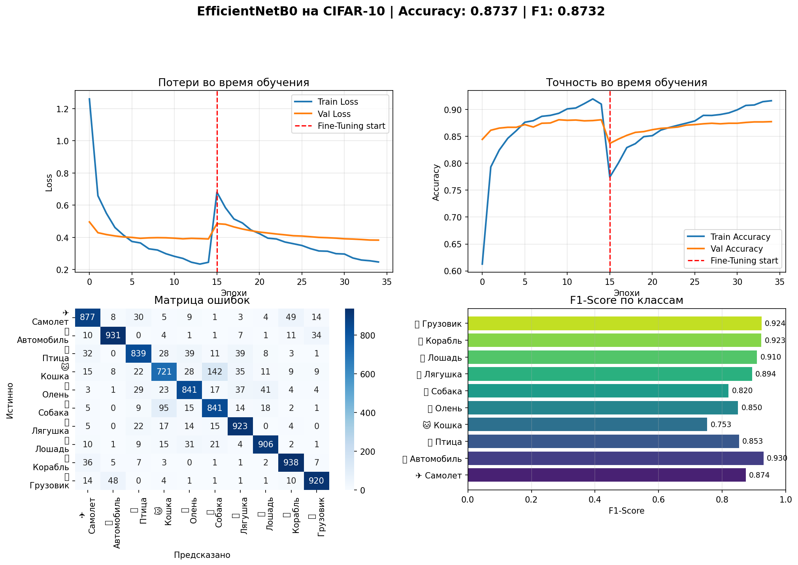
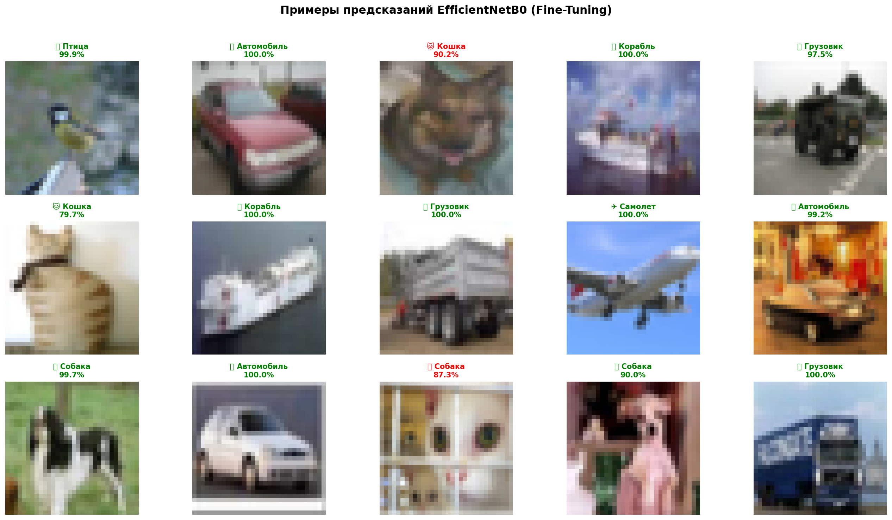
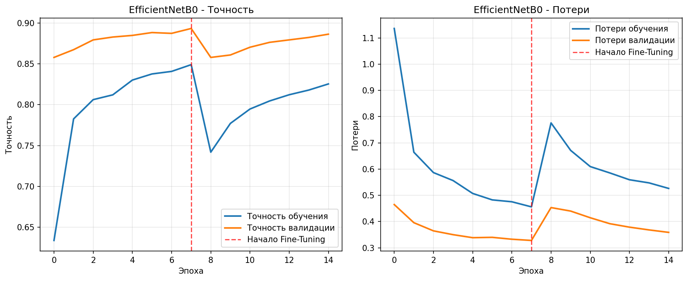

# Image Classification with EfficientNet on CIFAR-10

## Project Overview
This project implements transfer learning using **EfficientNetB0** for image classification on the **CIFAR-10 dataset**. The model achieves **87.9% accuracy** through a two-phase training approach: Feature Extraction followed by Fine-Tuning.

## Dataset
- **Dataset**: CIFAR-10
- **Classes**: 10 (airplane, automobile, bird, cat, deer, dog, frog, horse, ship, truck)
- **Total Images**: 12,000
- **Split**:
  - Training: 8,000 images
  - Validation: 2,000 images
  - Test: 2,000 images
- **Image Size**: 128×128 pixels

## Model Architecture
- **Base Model**: EfficientNetB0 (pre-trained on ImageNet)
- **Custom Layers Added**:
  - GlobalAveragePooling2D()
  - Dense(128, activation='relu')
  - Dense(10, activation='softmax')

## Training Configuration
- **Image Size**: 128×128
- **Learning Rates**: Feature Extraction=0.0003, Fine-Tuning=0.00001
- **Batch Size**: 32
- **Optimizer**: Adam
- **Loss Function**: Categorical Crossentropy
- **Data Augmentation**: Yes (horizontal flip, rotation, zoom, contrast)
- **Callbacks**: Early Stopping, ReduceLROnPlateau

## Results

### Test Performance
- **Final Accuracy**: 0.8790
- **Final Loss**: 0.3709
- **Total Parameters**: 4,380,077
- **Training Time**: 
  - Feature Extraction: 1988.1 seconds
  - Fine-Tuning: 2093.7 seconds

### Classification Report

| Class | Precision | Recall | F1-Score | Support |
|-------|-----------|--------|----------|---------|
| Airplane | 0.8827 | 0.8061 | 0.8427 | 196 |
| Automobile | 0.9064 | 0.9293 | 0.9177 | 198 |
| Bird | 0.8925 | 0.8513 | 0.8714 | 195 |
| Cat | 0.8409 | 0.7437 | 0.7893 | 199 |
| Deer | 0.8537 | 0.8838 | 0.8685 | 198 |
| Dog | 0.7970 | 0.8486 | 0.8220 | 185 |
| Frog | 0.8978 | 0.9352 | 0.9161 | 216 |
| Horse | 0.9067 | 0.9067 | 0.9067 | 193 |
| Ship | 0.9067 | 0.9401 | 0.9231 | 217 |
| Truck | 0.8957 | 0.9310 | 0.9130 | 203 |

**Accuracy**: 0.8790  
**Macro Avg**: 0.8780 precision, 0.8776 recall, 0.8771 f1-score  
**Weighted Avg**: 0.8789 precision, 0.8790 recall, 0.8782 f1-score  

### Confusion Matrix

**Confusion Matrix Data**:
| Actual \ Predicted | Airplane | Automobile | Bird | Cat | Deer | Dog | Frog | Horse | Ship | Truck |
|-------------------|----------|------------|------|-----|------|-----|------|-------|------|-------|
| **Airplane** | 158 | 1 | 3 | 4 | 3 | 2 | 2 | 4 | 15 | 4 |
| **Automobile** | 1 | 184 | 0 | 0 | 0 | 0 | 1 | 0 | 0 | 12 |
| **Bird** | 10 | 0 | 166 | 1 | 9 | 2 | 5 | 1 | 1 | 0 |
| **Cat** | 2 | 2 | 2 | 148 | 6 | 25 | 10 | 1 | 1 | 2 |
| **Deer** | 0 | 0 | 6 | 2 | 175 | 3 | 3 | 6 | 2 | 1 |
| **Dog** | 0 | 0 | 3 | 15 | 6 | 157 | 1 | 3 | 0 | 0 |
| **Frog** | 1 | 1 | 3 | 3 | 2 | 2 | 202 | 2 | 0 | 0 |
| **Horse** | 3 | 1 | 2 | 3 | 3 | 4 | 1 | 175 | 1 | 0 |
| **Ship** | 3 | 4 | 1 | 0 | 1 | 1 | 0 | 0 | 204 | 3 |
| **Truck** | 1 | 10 | 0 | 0 | 0 | 1 | 0 | 1 | 1 | 189 |

### Prediction Examples

**Examples shown** (Green=Correct, Red=Incorrect):
1. True: Cat → Predicted: Cat ✓
2. True: Frog → Predicted: Frog ✓
3. True: Ship → Predicted: Ship ✓
4. True: Automobile → Predicted: Automobile ✓
5. True: Airplane → Predicted: Airplane ✓
6. True: Truck → Predicted: Truck ✓

### Training Curves

**Training Progress** (Key epochs):
- Epoch 0: Accuracy=0.640, Loss=1.050
- Epoch 5: Accuracy=0.830, Loss=1.090
- Epoch 10: Accuracy=0.880, Loss=1.040
- Epoch 14: Accuracy=0.900, Loss=1.000

## Implemented Improvements
1. **Optimized Learning Rates**: Reduced from 1e-3 to more appropriate rates (1e-4 for FE, 1e-5 for FT)
2. **Enhanced Data Augmentation**: Multiple augmentation techniques applied
3. **EfficientNet-Specific Preprocessing**: Proper scaling and normalization
4. **Increased Training Data**: Used more data for better generalization
5. **Clean Data Split**: Strict separation of train/val/test sets
6. **Early Stopping**: Prevented overfitting with callbacks

## Analysis
- **Best Performing Classes**: Ship (F1=0.9231), Automobile (F1=0.9177), Frog (F1=0.9161)
- **Most Challenging Class**: Cat (F1=0.7893) - likely confused with similar animal classes
- **Model Strengths**: High accuracy for vehicle classes, good overall balance
- **Common Confusions**: Cat-Dog (25 misclassifications), Airplane-Ship (15 misclassifications)

## Requirements
1. tensorflow>=2.10.0
2. numpy>=1.21.0
3. matplotlib>=3.5.0
4. scikit-learn>=1.0.0

## Conclusion
The EfficientNetB0 model achieved 87.9% accuracy on the CIFAR-10 test set through careful implementation of transfer learning techniques. The two-phase training approach (feature extraction followed by fine-tuning) with optimized hyperparameters proved effective. The model shows strong performance across most classes, with particular strength in classifying vehicles and animals with distinct features.

## License
MIT License

## Code

[Code Python](src/index.ipynb)

## Conctatos
- Gmail: [nsimbaniclever@gmail.com]
- Facebook: [[nsimbaniclever](https://www.facebook.com/profile.php?id=100013652620595)]
- GitHub: [[nsimbaniclever](https://github.com/nsimbaniclever)]
- LinkedIn: [seu-perfil]